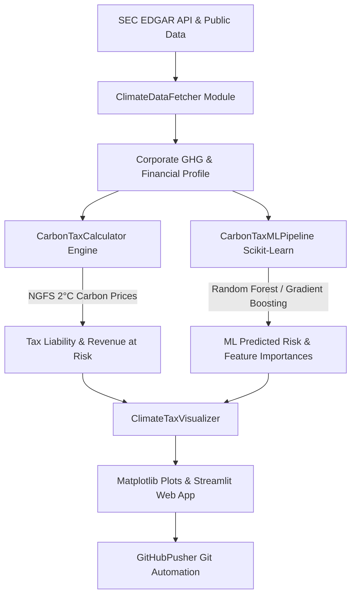

# Corporate Climate Data API & 2°C Carbon Tax ML Engine 🌿📈

[](https://github.com/navaleanjali24-ctrl/corporate-climate-tax-ml/actions)
[](https://www.python.org/)
[](https://opensource.org/licenses/MIT)

An end-to-end Python software system and predictive analytics framework that fetches public corporate climate and financial data via public APIs (SEC EDGAR & GHG Protocol benchmarks), models future carbon taxation liabilities under NGFS / IPCC 2°C climate transition scenarios (2025–2050), trains machine learning models to project financial risks, generates visualization charts, and automates Git repository workflows.

---

## 🏛️ System Architecture



---

## 📐 Mathematical Formulation

### 1. Direct Carbon Tax Liability ($USD)
$$\text{Tax Liability}_{y, s} = \left[ \text{Scope 1}_{y} + \text{Scope 2}_{y} + w_3 \cdot \text{Scope 3}_{y} \right] \cdot P_{y, s}$$

Where:
- $\text{Scope 1, 2, 3}_{y} = \text{Emissions}_{2025} \cdot (1 - \delta)^{y - 2025}$
- $\delta$: Annual corporate decarbonization rate (default 3.0%)
- $w_3$: Scope 3 pass-through weight factor (default 0.20)
- $P_{y, s}$: Projected NGFS carbon price ($/tCO_2e$) for year $y$ under climate scenario $s$

### 2. Revenue at Risk (%)
$$\text{Revenue at Risk}_{y, s} = \left( \frac{\text{Direct Tax Liability}_{y, s}}{\text{Annual Revenue}} \right) \cdot 100$$

### 3. Machine Learning Prediction Model
$$\hat{Y}_{\text{tax}} = f_{\text{RandomForest}}\left( \log(\text{Revenue}), \text{EBITDA Margin}, \mathbf{I}_{\text{Scope 1,2,3}}, \mathbf{S}_{\text{Sector}}, P_{y, s} \right)$$

---

## 🚀 Quickstart & Setup

### Prerequisites
- Python 3.9+ or `uv` package manager installed.

### Installation via `uv` (Recommended)
```bash
# Clone the repository
git clone https://github.com/navaleanjali24-ctrl/corporate-climate-tax-ml.git
cd corporate-climate-tax-ml

# Install dependencies using uv
uv sync
```

### Installation via `pip`
```bash
python -m pip install -e .
```

---

## 💻 Usage & CLI Commands

### 1. Analyze Single Corporate Entity (e.g. Apple Inc.)
```bash
uv run python main.py --company AAPL --scenario 2C
```

### 2. Run Corporate Benchmark Across Top 10 Tickers
```bash
uv run python main.py --batch
```

### 3. Force Retrain ML Pipeline
```bash
uv run python main.py --train-ml
```

### 4. Launch Interactive Streamlit Web App
```bash
uv run streamlit run app.py
```

### 5. Git Automation & GitHub Push
```bash
uv run python main.py --company TSLA --push-github --remote https://github.com/navaleanjali24-ctrl/corporate-climate-tax-ml.git
```

---

## 🧪 Running Automated Tests

```bash
uv run pytest -v tests/
```

---

## 📁 Repository Structure

```
.
├── .github/
│   └── workflows/
│       └── ci.yml                 # GitHub Actions CI pipeline
├── src/
│   ├── __init__.py
│   ├── data_fetcher.py            # SEC EDGAR & climate data API integration
│   ├── tax_calculator.py          # NGFS 2°C carbon price trajectory engine
│   ├── ml_model.py                # Scikit-Learn ML training & inference pipeline
│   ├── visualizer.py              # Matplotlib chart visualizer
│   └── github_pusher.py          # Git staging, commit & GitHub push automation
├── tests/
│   ├── test_data_fetcher.py       # Unit tests for data fetching
│   ├── test_tax_calculator.py     # Unit tests for tax scenario calculations
│   └── test_ml_model.py           # Unit tests for ML pipeline
├── main.py                        # Rich CLI application entrypoint
├── app.py                         # Interactive Streamlit Web Dashboard
├── pyproject.toml                 # Dependencies and package metadata
├── README.md                      # Project documentation
└── .gitignore                     # Git rules
```

---

## 📄 License
This project is licensed under the MIT License - see the LICENSE file for details.
